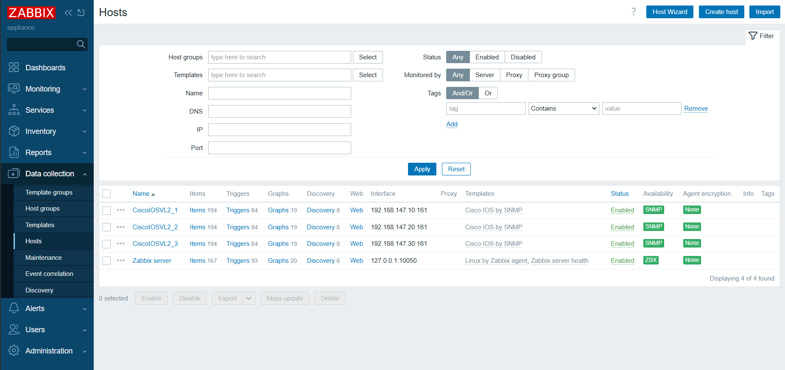
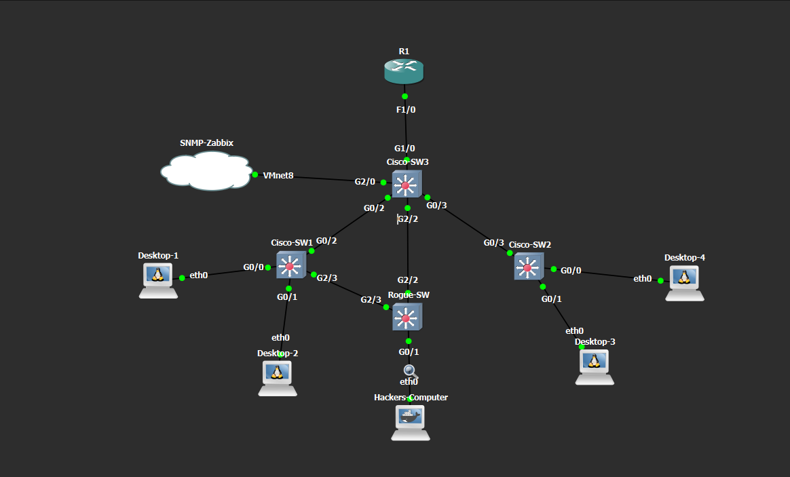
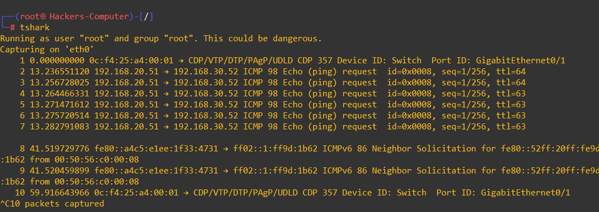

# Enterprise Layer 2/3 Infrastructure: STP Stress Testing & Monitoring Simulation

This technical report documents the end-to-end reconstruction, verification, and fault-injection architecture of an enterprise network matrix. The topology evaluates logical segmentation via Per-VLAN Spanning Tree Plus (PVST+), centralized core hierarchy, Layer 3 Inter-VLAN routing via Router-on-a-Stick (RoaS), and dynamic IP allocation.

---

## Technical Roadmap & Execution Phases
1. **Building Architecture & Physical Topology Mapping**
2. **Layer 2 Core & Distribution Configuration (VLANs & Trunks)**
3. **Layer 3 Inter-VLAN Routing (Router-on-a-Stick)**
4. **Dynamic Control Plane Deployment (DHCP & Exclusions)**
5. **Telemetry & In-Band Management Setup (SNMP & Zabbix)**
6. **Edge Access Optimization & Troubleshooting (PortFast & BPDU Guard)**
7. **Controlled Fault Injection & Monitored Anomalies (Broadcast Storm)**
8. **Strategic Infiltration & Root Authority (MitM via STP Exploitation)**

---

## Phase 1: Building Architecture & Physical Topology Mapping

Based on the verified active topology layout, the physical interconnection matrix is established as follows:
* **Core Switch (Cisco-SW3) Uplink:** `Gi1/0` $\rightarrow$ Router R1 `F1/0`
* **Core Switch (Cisco-SW3) Downlinks:** * `Gi0/2` $\rightarrow$ Cisco-SW1 `Gi0/2`
  * `Gi0/3` $\rightarrow$ Cisco-SW2 `Gi0/3`
  * `Gi2/0` $\rightarrow$ Cloud Node / SNMP-Zabbix (`VMnet8`)
* **Attacker / Rogue Nodes:**
  * `Cisco-SW3` `Gi2/2` $\rightarrow$ `Rogue-SW` `Gi2/2`
  * `Cisco-SW1` `Gi2/3` $\rightarrow$ `Rogue-SW` `Gi2/3`
  * `Rogue-SW` `Gi0/1` $\rightarrow$ `Hackers-Computer` `eth0`
* **Access Layer Edge Ports:**
  * Cisco-SW1: `Gi0/0` (Desktop-1), `Gi0/1` (Desktop-2)
  * Cisco-SW2: `Gi0/1` (Desktop-3), `Gi0/0` (Desktop-4)

---

## Phase 2: Layer 2 Core & Distribution Configuration

### 1. Core Layer: Switch-3 (MDF / Core) Configuration
Switch-3 acts as the absolute Root Bridge for all segments. It multiplexes departmental and management data streams and enforces root protection on downlinks.

```ios
Cisco-SW3> enable
Cisco-SW3# configure terminal

! Define Enterprise Logical Broadcast Domains
Cisco-SW3(config)# vlan 20
Cisco-SW3(config-vlan)# name Engineering
Cisco-SW3(config-vlan)# vlan 30
Cisco-SW3(config-vlan)# name Sales_Accounting
Cisco-SW3(config-vlan)# vlan 147
Cisco-SW3(config-vlan)# name Management_Zone
Cisco-SW3(config-vlan)# exit

! Assign Static Core Management Interface
Cisco-SW3(config)# interface vlan 147
Cisco-SW3(config-if)# ip address 192.168.147.30 255.255.255.0
Cisco-SW3(config-if)# no shutdown
Cisco-SW3(config-if)# exit

! Configure Inter-Switch Trunk Links (Downlinks & Router Uplink)
Cisco-SW3(config)# interface range GigabitEthernet0/2 - 3 , GigabitEthernet1/0
Cisco-SW3(config-if-range)# switchport trunk encapsulation dot1q
Cisco-SW3(config-if-range)# switchport mode trunk
Cisco-SW3(config-if-range)# switchport trunk allowed vlan 1,20,30,147
Cisco-SW3(config-if-range)# no shutdown
Cisco-SW3(config-if-range)# exit

! Configure In-Band Telemetry Access Port
Cisco-SW3(config)# interface GigabitEthernet2/0
Cisco-SW3(config-if)# switchport mode access
Cisco-SW3(config-if)# switchport access vlan 147
Cisco-SW3(config-if)# spanning-tree portfast
Cisco-SW3(config-if)# no shutdown
Cisco-SW3(config-if)# exit

! Enforce Absolute Core Root Bridge Seniority & Root Guard Policy
Cisco-SW3(config)# spanning-tree vlan 1,20,30,147 priority 4096
Cisco-SW3(config)# interface range GigabitEthernet0/2 - 3
Cisco-SW3(config-if-range)# spanning-tree guard root
Cisco-SW3(config-if-range)# exit

Cisco-SW3(config)# ip default-gateway 192.168.147.1
Cisco-SW3(config)# exit
Cisco-SW3# copy running-config startup-config

```

### 2. Distribution Layer: Switch-1 & Switch-2 Configuration

Downstream access switches reflect identical VLAN databases while acting as local demarcation points for end-devices.

* **Cisco-SW1:** Management IP `192.168.147.10/24` on SVI 147. Trunk port `Gi0/2`.
* **Cisco-SW2:** Management IP `192.168.147.20/24` on SVI 147. Trunk port `Gi0/3`.

---

## Phase 3: Layer 3 Inter-VLAN Routing (Router-on-a-Stick)

To handle routing operations between isolated broadcast domains, Router R1 splits its physical interface into logical subinterfaces matching the 802.1Q tags deployed at Layer 2.

```ios
R1> enable
R1# configure terminal

interface FastEthernet1/0
 no ip address
 no shutdown
exit

! Subinterface for Engineering (VLAN 20)
interface FastEthernet1/0.20
 encapsulation dot1Q 20
 ip address 192.168.20.1 255.255.255.0
exit

! Subinterface for Sales (VLAN 30)
interface FastEthernet1/0.30
 encapsulation dot1Q 30
 ip address 192.168.30.1 255.255.255.0
exit

! Subinterface for Management Plane (VLAN 147)
interface FastEthernet1/0.147
 encapsulation dot1Q 147
 ip address 192.168.147.1 255.255.255.0
exit

```

---

## Phase 4: Dynamic Control Plane Deployment (DHCP Server)

To automate host configurations, R1 executes a local DHCP daemon. Static infrastructure reservations are explicitly isolated using exclusion commands to block address compilation conflicts.

```ios
! --- Prevent Allocation Collisions with Gateways and SVIs ---
ip dhcp excluded-address 192.168.20.1 192.168.20.10
ip dhcp excluded-address 192.168.30.1 192.168.30.10
ip dhcp excluded-address 192.168.147.1 192.168.147.50

! --- DHCP Pool Configuration Matrix ---
ip dhcp pool ENGINEERING_POOL
 network 192.168.20.0 255.255.255.0
 default-router 192.168.20.1
 dns-server 8.8.8.8
 exit

ip dhcp pool SALES_POOL
 network 192.168.30.0 255.255.255.0
 default-router 192.168.30.1
 dns-server 8.8.8.8
 exit

ip dhcp pool MANAGEMENT_POOL
 network 192.168.147.0 255.255.255.0
 default-router 192.168.147.1
 dns-server 8.8.8.8
 exit

```

---

## Phase 5: Telemetry & In-Band Management Setup

SNMPv2c parameters are instantiated uniformly to facilitate real-time polling updates over the dedicated `VMnet8` interface mapped to the external monitoring environment. (Configuration synchronized across Switch-1, Switch-2, and Switch-3).

```ios
Cisco-Switch(config)# snmp-server community zabbixro RO
Cisco-Switch(config)# snmp-server contact STP-NOC-Lab
Cisco-Switch(config)# snmp-server location GNS3-DC

```

### Zabbix Frontend Host Configuration (SNMP Integration)

Following the SNMP configuration on the Cisco nodes, monitoring objects were manually instantiated via the Zabbix Server Frontend.

**Host Provisioning Steps:**
Navigated to `Data collection -> Hosts -> Create host` to provision the three switches with the following parameters:

1. **Host Names:** `CiscoIOSVL2_1`, `CiscoIOSVL2_2`, `CiscoIOSVL2_3`
2. **Templates:** Linked the industry-standard `Cisco IOS by SNMP` template.
3. **Host Groups:** Assigned to `Cisco`, `IOS`, and `Switch` host groups.
4. **Interfaces:** Selected `Add -> SNMP` and bound the respective Management IP addresses:
   * **CiscoIOSVL2_1:** `192.168.147.10` (Port: 161)
   * **CiscoIOSVL2_2:** `192.168.147.20` (Port: 161)
   * **CiscoIOSVL2_3:** `192.168.147.30` (Port: 161)

Successful telemetry ingestion was validated upon the `SNMP` availability icon turning green.

 
 
 


* **Hypervisor Remediation:** The VMware Network Editor DHCP scope for `VMnet8` was expanded from `.127-.256` down to `.1-.254` to establish data alignment with infrastructure nodes located below the `.127` boundary.

---

## Phase 6: Edge Access Optimization & Troubleshooting

### 1. Root-Cause Analysis of the "udhcpc Lease Failure"

During early testing, booted Linux Docker guests recorded continuous timeout indicators:

```text
udhcpc: sending discover
udhcpc: sending discover
udhcpc failed to get a DHCP lease

```

* **Analysis:** Because edge nodes lacked performance acceleration profiles, the physical ports initiated a full Spanning Tree transition loop (spanning 30 seconds across standard Listening and Learning phases). The stateless `udhcpc` configuration executed its 3 allocation queries inside the initial 10-second window and terminated before the port reached a forwarding status.

### 2. Edge Access Port Stabilization Policy

To counteract convergence race conditions and fortify edge security against rogue switches (Scenario 1 / Scenario 2), access profiles are mandated to instantly transition while tracking configuration abuse via BPDU Guard.

```ios
Cisco-SW1(config)# interface range GigabitEthernet0/0 - 1
Cisco-SW1(config-if-range)# switchport mode access
Cisco-SW1(config-if-range)# switchport access vlan 20  ! (Or VLAN 30 depending on Host placement)
Cisco-SW1(config-if-range)# spanning-tree portfast
Cisco-SW1(config-if-range)# spanning-tree bpduguard enable
Cisco-SW1(config-if-range)# no shutdown

```

---

## Phase 7: Controlled Fault Injection & Out-of-Band Mitigation


#### Scenario 1: The "Well-Meaning Intern" (Unplanned Loop Insertion)

**Objective:** To simulate a severe Layer 2 broadcast storm caused by an unauthorized, unmanaged switch introduction, bypassing default architectural defenses to observe the cascading failure (Fate Sharing) across the enterprise infrastructure.

##### Step 1: The Illusion of Default Protection (Self-Loop Detection)

An unmanaged switch (`Harmful-SW`) was connected redundantly via two links (`g2/1` and `g2/2`) to `Cisco-SW2` in the Access Layer. Initially, the anticipated broadcast storm did not occur. The baseline traffic remained stable at roughly $400-500\text{ bps}$.

* **Technical Root Cause:** The Rapid Per-VLAN Spanning Tree (RPVST+) protocol actively monitored the ports. `Cisco-SW2` detected its own BPDU packets echoing back through `Harmful-SW`. It immediately identified the physical loop and algorithmically forced one of the interfaces into a `Blocking` state, neutralizing the threat autonomously.

##### Step 2: Blinding the Defense Mechanism (BPDU Filter Injection)

To force the infrastructure into a failure state and simulate an environment lacking proper Edge Port security (i.e., missing `bpduguard`), the spanning-tree topology protection was intentionally blinded on the compromised interfaces.

**Execution (Cisco-SW2 CLI):**

```ios
Cisco-SW2# configure terminal
Cisco-SW2(config)# interface range g2/1-2
Cisco-SW2(config-if-range)# spanning-tree bpdufilter enable
Cisco-SW2(config-if-range)# exit

```

*By applying `bpdufilter`, the switch was instructed to silently drop all incoming and outgoing BPDU packets, rendering the loop-prevention algorithm entirely deaf to the Layer 2 topology.*

##### Step 3: Exponential Packet Replication & CPU Saturation (The Crush)

Milliseconds after the BPDU filter injection, background broadcast packets (e.g., ARP, CDP) entered the unmanaged switch and were replicated infinitely. The physical limitations of the vCPU were breached.

**Evidence from Console (Control Plane Collapse):**
The command line interfaces of the affected switches became completely unresponsive, outputting endless interrupt errors.


* **Analysis:** The software processing queue was completely overrun by rogue frames. Processes like "ARP Background" and "Spanning Tree" attempted to calculate the incoming flood, driving CPU utilization directly to $100\%$.

##### Step 4: Cascading Failure & Monitoring Blindspot (Fate Sharing)

The telemetry system (Zabbix) behavior highlighted a critical sector reality: Monitoring tools document the *consequence* of a storm, not the storm itself, if the processing limit is exceeded before the polling interval.

**Zabbix Incident Logs:**
The CPU saturation prevented the Cisco devices from responding to ICMP Echo requests and UDP 161 (SNMP) polling.


* **Analysis (The Blast Radius):** The storm did not isolate itself to the Access Layer (`SW2`). Because the inter-switch links were configured as Trunks, the broadcast frames traversed the 802.1Q boundary, flooding the Core Layer (`SW3`) and subsequently paralyzing the other Access nodes (`SW1`).

##### Step 5: Out-of-Band Mitigation (Layer 1 Interruption) & Lessons Learned

Because the Control Plane was locked and CLI input was rejected by the OS scheduler, logical mitigation (e.g., executing `shutdown` on the port) was impossible. The loop had to be severed at the physical layer. The virtual cable connecting `Harmful-SW` to `Cisco-SW2` was destroyed.

* **Result:** The moment the circuit was broken, packet replication ceased. The hardware buffers flushed the residual broadcast frames, CPU processing returned to baseline levels, and the SNMP/ICMP daemons resumed communication with the Zabbix server, clearing the alarm state.

**Conclusion for Scenario 1:** Relying solely on VLAN isolation is statistically insufficient. An unprotected edge port compromises the entire hierarchical topology. The absolute necessity of `spanning-tree bpduguard enable` on all access interfaces is mathematically and operationally validated.

**Lessons Learned (Architectural Constraint):** The CPU saturation immediately severed In-Band management access. This incident proves that **Out-of-Band (OOB) management** (physically isolated console servers/networks) is an absolute necessity for enterprise recovery during Control Plane collapse.

---

### Phase 8: Strategic Infiltration & Root Authority (MitM via STP Exploitation)

**Objective:** To achieve comprehensive Layer 2 traffic interception by forcing the `Rogue-SW` into a `Root Bridge` role within a segmented environment, thereby overriding existing spanning-tree priorities and redirecting inter-VLAN traffic through the attacker's monitoring node.



#### Scenario 2: The "Shadow Bridge" (Authorized Topology Manipulation)

##### Step 1: Baseline Integrity Assessment

Initial network observation confirmed that `Cisco-SW3` was the designated Root Bridge for all enterprise VLANs ($1, 20, 30, 147$), maintaining stability with a configured priority of $4096$. The enterprise core enforced a strict "Root Guard" policy, and trunk ports utilized `switchport nonegotiate` to block dynamic trunking exploitation.

* **Initial Status:** The `Rogue-SW` was positioned as a subordinate participant in the spanning-tree calculation, yielding to the Core's superior priority.

##### Step 2: Logical VLAN Injection

To exert influence, the attacker must align their local logical environment with the victim's. Simply assigning a priority value is insufficient if the target VLAN instances do not exist on the attacker's switch.

**Execution (Rogue-SW CLI):**

```ios
Rogue-SW(config)# vlan 20,30,147
Rogue-SW(config)# spanning-tree vlan 1,20,30,147 priority 0

```

* **Result:** By force-provisioning the VLAN database, the `Rogue-SW` initialized local STP instances. The `priority 0` value effectively signaled the network that the attacker's node possessed the lowest bridge ID, qualifying it as the authoritative path for all segments.

##### Step 3: Traffic Mirroring & The "Passive Observer" Constraint

With the logical groundwork laid, the attacker attempted to intercept production traffic. However, despite successfully claiming root status, data interception was initially limited to passive mirroring.

**Execution (Rogue-SW Monitoring):**

```ios
Rogue-SW(config)# monitor session 1 source interface gi2/2, gi2/3 both
Rogue-SW(config)# monitor session 1 destination interface gi0/1

```

* **Evidence from Capture (tshark/wireshark):**

* **Analysis:** The capture confirmed successful frame redirection via SPAN. However, the attacker noted a critical distinction: the switch was acting as an observer, not an active gateway. The traffic originated from the victims' standard routing paths, with the `Rogue-SW` merely receiving a duplicate stream.

##### Step 4: The Reconnaissance Gap (VLAN ID & IP Correlation)

A significant tactical failure occurred due to a lack of visibility into the production VLAN tags. While IP subnets (e.g., $192.168.147.x$) were observable via ARP probes, the absence of 802.1Q tags in the capture indicated "VLAN Pruning" on the trunk links, which prevented the attacker from injecting tagged frames directly into the target segment.

**Observation Log:**

```text
Logical-Link Control, Cisco Discovery Protocol
Native VLAN: 1

```

* **Root Cause Analysis:** The `CDP` frames exposed that the inter-switch links were strictly pruned. The `Rogue-SW` was isolated to `Native VLAN 1`, confirming that architectural hardening (restricting allowed VLANs on trunks) effectively neutralized the attacker's ability to "hop" into production VLANs without pre-existing logical credentials.

##### Step 5: Conclusion & Security Implications

The attack failed to escalate into an **Active MitM** (packet modification/injection) because the `Rogue-SW` lacked authorized access to the production VLANs. Even as the `Root Bridge`, the attacker was restricted by the logical boundaries of the pruned trunk links.

* **Security Insight:** This simulation mathematically validates that "Root Authority" is useless without **logical access to the VLAN database**.
* **Defensive Metric:** The combination of `spanning-tree guard root` (on core-facing ports) and `switchport trunk allowed vlan` (pruning) creates a **highly resilient Layer 2 boundary**. The attacker was reduced to a "Passive Observer," unable to alter the destination of a single packet, despite controlling the topology. (Note: While highly resilient to this specific STP manipulation, true impregnability requires addressing Native VLAN vulnerabilities like Double Tagging).

**Conclusion for Scenario 2:**
Topology control via STP manipulation is a high-skill maneuver, but it is ultimately thwarted by **strict VLAN pruning** and **Root Guard policies**. The enterprise architecture proved resilient against logical redirection, forcing the attacker to confront the reality that control of the "Root" does not grant control over the "Data Plane" when VLANs are properly segmented and pruned.

---

## Phase 9: Lab Deployment & Execution Guide (Runbook)

This project relies on virtualization interoperability between GNS3 and VMware. Due to proprietary licensing, Cisco IOS images and specific VM disk files are not included in this repository. 

To reconstruct and execute this penetration testing lab, follow the operational steps below.

### 1. Prerequisites & Dependencies
* **Hypervisor:** VMware Workstation Pro / Player (v16+)
* **Simulator:** GNS3 (v2.2.x) with GNS3 VM running on VMware.
* **Required Images (User Provided):**
    * Cisco IOSvL2 (Switching) - `vios_l2-ADVENTERPRISEK9-M`
    * Cisco c7200 or IOSv (Routing) for Layer 3 RoaS.
    * Zabbix Server Appliance (VMware image or Docker container).
    * Kali Linux (VMware image) for MitM execution.

### 2. Virtual Network Mapping (VMnet8 Configuration)
The telemetry (Zabbix) and out-of-band monitoring rely on a specific NAT configuration bridging VMware and GNS3.
1. Open **VMware Virtual Network Editor**.
2. Select **VMnet8 (NAT)**.
3. Configure the Subnet IP to `192.168.147.0` with mask `255.255.255.0`.
4. Ensure the VMware DHCP scope is adjusted strictly between `.1` and `.254` to avoid allocation overlaps with the static infrastructure IPs defined in the topology.

### 3. Zabbix Appliance & GNS3 Cloud Integration
To enable Layer 2 reachability between the Zabbix Server VM and the GNS3 topology:
* **VMware Settings (Zabbix VM):** Navigate to the VM's Network Adapter settings, select `Custom: Specific virtual network`, and bind it to `VMnet8 (NAT)`. Power on the appliance.
* **GNS3 Settings (Cloud Node):** Drag a `Cloud` node into the GNS3 workspace. Right-click $\rightarrow$ `Configure` $\rightarrow$ `Ethernet interfaces`. Check `Show special Ethernet interfaces`, select `VMnet8` from the dropdown, and click `Add`. Connect the designated Cisco Switch interface (e.g., `Gi2/0`) to this `VMnet8` port on the Cloud node.

### 4. Execution Steps
1.  **Clone the Repository:**
    ```bash
    git clone [https://github.com/yourusername/STP-Stress-Testing.git](https://github.com/yourusername/STP-Stress-Testing.git)
    ```
2.  **Import Topology:** Open the `.gns3` file located in the `/topology` directory using the local GNS3 client.
3.  **Map Appliances:** Map the missing nodes to the locally installed Cisco IOSvL2/L3 and VMware instances if prompted.
4.  **Load Configurations:**
    * Power on all network nodes.
    * Open the console for each Cisco device.
    * Copy and paste the respective plain-text configurations located in the `/configs` directory into the global configuration mode (`config t`).
5.  **Verify Control Plane:** Execute `show ip dhcp binding` on the Router and `show spanning-tree summary` on the Core Switch to confirm architectural synchronization before initiating fault injections.